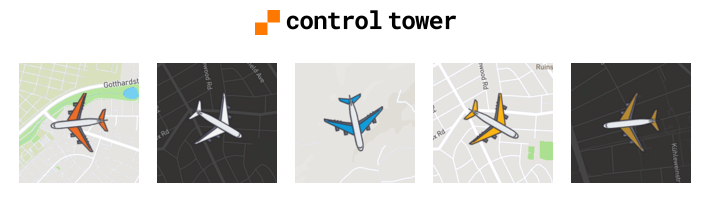
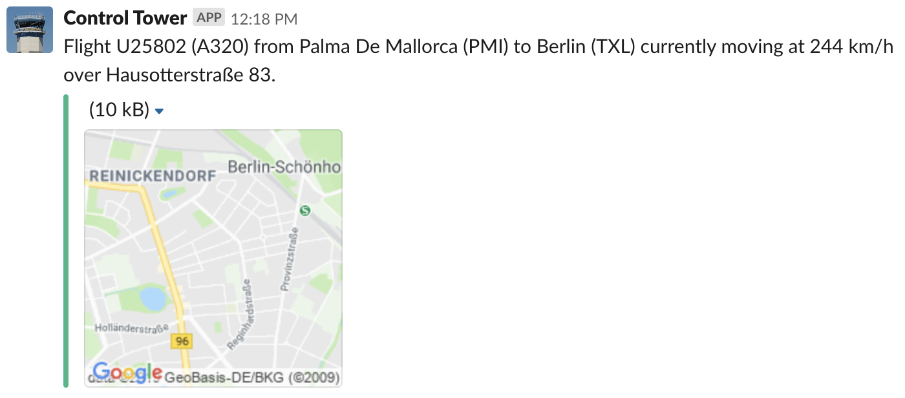

<h1 align="center">
  
</h1>

We saw flights landing in nearby Tegel airport from our office, and wondered where all those airplanes came from. So I made this, and now we just ask Slack for answers. Also learned some Clojure.

