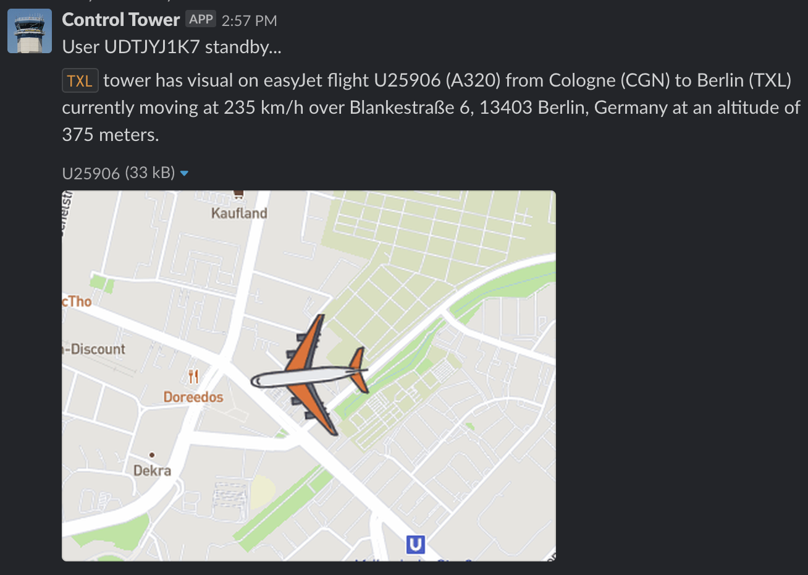

<h1 align="center">
  
</h1>

We saw flights landing in nearby Tegel airport from our office, and wondered where all those airplanes came from. So I made this, and now we just ask Slack for answers. Also learned some Clojure.

## Features

The control tower bot only supports the `TXL` and `SXF` airports, but I'm working hard to make it work with any airport in the world.

On Slack the bot needs permissions for slash commands, and incoming hooks. We have a dedicated channel for planespotting where each sighting is posted, allowing everyone on comment on it.

* Running the spotting commands on the designated channel will post a response to that channel, visible to members
* Running the commands anywhere else will also post to the designated channel openly, but also immediately to wherever you executed the command, but visible only to you -- this way you don't need to change channels
* Currently only two commands are available: `/txl` and `/sxf` for Tegel and Schönefeld airports, respectively. More are TBA. 
